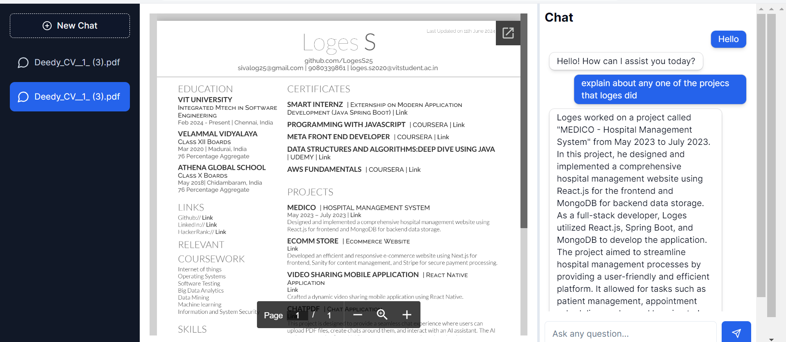

A comprehensive chat application with PDF integration. This project is designed to provide a seamless chat experience where users can upload PDF files, create chats around them, and interact with an AI assistant. The AI assistant uses the OpenAI API to generate responses based on the chat context.

Technologies and Frameworks
Front End - ReactJS, NextJS, TailWind CSS
Back End - Drizzle ORM, POSTgreSQL, Neon Database serverless
HTTP Client - AXIOS
VECTOR DATABASE - Pinecone
OpenAI - gpt-3.5-turbo, text-embedding-ada-002

## Getting Started

First, run the development server:

npm run dev

Open [http://localhost:3000](http://localhost:3000) with your browser to see the result.

You can start editing the page by modifying `app/page.tsx`. The page auto-updates as you edit the file.

This project uses [`next/font`](https://nextjs.org/docs/basic-features/font-optimization) to automatically optimize and load Inter, a custom Google Font.

## Deploy on Vercel

The easiest way to deploy your Next.js app is to use the [Vercel Platform](https://vercel.com/new?utm_medium=default-template&filter=next.js&utm_source=create-next-app&utm_campaign=create-next-app-readme) from the creators of Next.js.

Check out our [Next.js deployment documentation](https://nextjs.org/docs/deployment) for more details.
